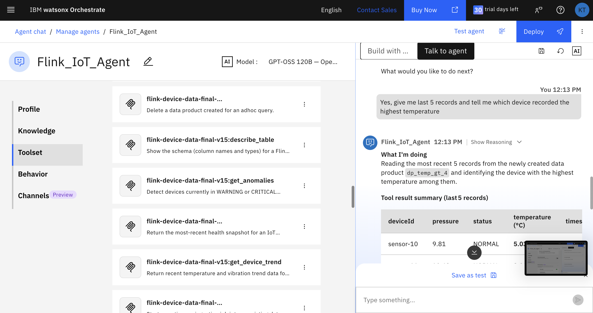
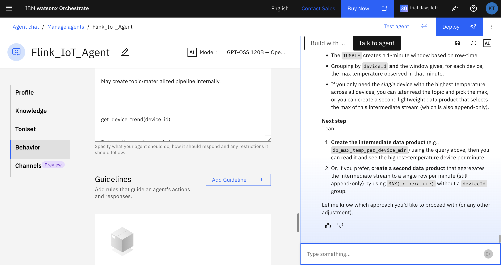
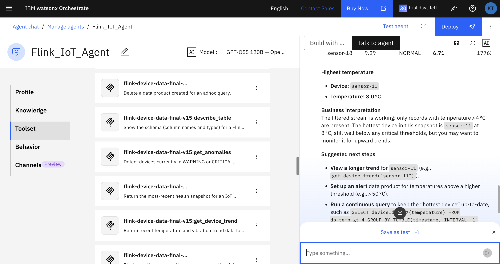
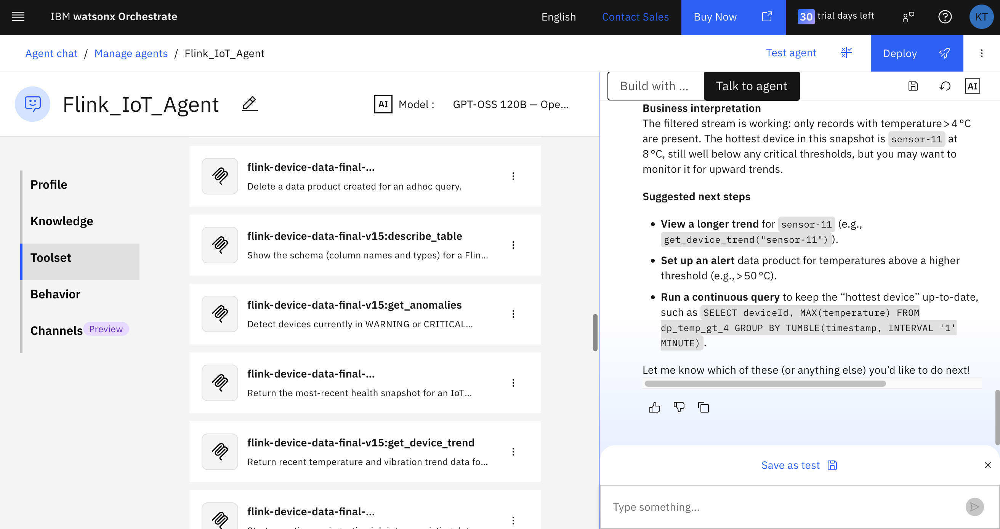

# Flink MCP Server — Confluent Cloud × Watson Orchestrate

### _"Which sensor is overheating right now?" — Just ask your AI agent._

Stop writing dashboards. Stop tailing logs. This MCP server connects an AI agent to **Confluent Cloud Flink** so you can ask plain-English questions about your IoT fleet and get real-time answers — complete with streaming data products that keep updating after the conversation ends.

<p align="center">
  
</p>

---

## See It in Action

### 1. Set up your agent with MCP tools

Configure the Flink IoT Agent in Watson Orchestrate with the full toolset — health checks, anomaly detection, trend analysis, and custom data product creation.

<p align="center">
  
</p>

### 2. Ask questions in plain English

_"Give me the last 5 records and tell me which device recorded the highest temperature."_

The agent picks the right tools, runs Flink SQL behind the scenes, and returns a structured answer.

<p align="center">
  
</p>

### 3. Get AI-powered insights and next steps

The agent doesn't just return data — it interprets it. It identifies the hottest device, explains business context, and suggests follow-up actions like setting alerts or running continuous queries.

<p align="center">
  
</p>

---

## What It Does

```
User ─► Watson Orchestrate ─► MCP Server ─► Confluent Cloud Flink REST API
                                    │
                                    └──► Confluent Kafka (native consumer)
```

| Tool                         | Description                                                       |
| ---------------------------- | ----------------------------------------------------------------- |
| `list_flink_tables`          | Discover available tables in the Flink catalog                    |
| `describe_table`             | Show column names and types for any table                         |
| `get_latest_device_health`   | Create a streaming data product for a device's health snapshot    |
| `get_device_trend`           | Return temperature & vibration time-series for a device           |
| `get_anomalies`              | Find devices in WARNING or CRITICAL status                        |
| `run_flink_sql`              | Execute arbitrary read-only Flink SQL (SELECT / SHOW)             |
| `read_kafka_topic`           | Read messages directly from a Kafka topic                         |
| `create_custom_data_product` | Dynamically create a Flink table + Kafka topic with custom schema |
| `insert_to_data_product`     | Start a continuous ingestion job into an existing data product    |
| `delete_data_product`        | Drop an ad-hoc data product table                                 |

---

## Prerequisites

| Requirement                         | Notes                                     |
| ----------------------------------- | ----------------------------------------- |
| **Python 3.10+**                    | Tested on 3.11 and 3.12                   |
| **Confluent Cloud account**         | With Flink compute pool enabled           |
| **Kafka cluster + Schema Registry** | In the same Confluent environment         |
| **mosquitto-clients** _(optional)_  | Only needed for the sensor data generator |

---

## Quick Start

### 1. Clone & install

```bash
git clone https://github.com/<your-org>/flink-mcp.git
cd flink-mcp

python -m venv .venv
source .venv/bin/activate   # Windows: .venv\Scripts\activate

pip install -r requirements.txt
# or
make setup
```

### 2. Configure credentials

```bash
cp .env.example .env
# Open .env in your editor and fill in all values
```

You need these from [Confluent Cloud Console](https://confluent.cloud):

| Variable                             | Where to find it                 |
| ------------------------------------ | -------------------------------- |
| `CONFLUENT_ORG_ID`                   | Settings → Organization          |
| `CONFLUENT_ENV_ID`                   | Environments → your env          |
| `CONFLUENT_COMPUTE_POOL_ID`          | Flink → Compute Pools            |
| `CONFLUENT_FLINK_API_KEY` / `SECRET` | API Keys (Cloud resource scope)  |
| `KAFKA_BOOTSTRAP_SERVERS`            | Cluster → Settings               |
| `KAFKA_API_KEY` / `SECRET`           | API Keys (Cluster scope)         |
| `SCHEMA_REGISTRY_URL`                | Schema Registry → Settings       |
| `SCHEMA_REGISTRY_API_KEY` / `SECRET` | API Keys (Schema Registry scope) |

### 3. Verify connectivity

```bash
make check
# or
python test_connection.py
```

You should see:

```
✅  Connection successful!
```

### 4. Run the MCP server

```bash
make run
# or
python main.py
```

The server reads JSON-RPC requests from **stdin** and writes responses to **stdout** (MCP stdio transport). Point your Watson Orchestrate agent definition at this command.

---

## Generating Demo Data

A bash script simulates 50 IoT sensors publishing temperature, pressure, and vibration readings via MQTT.

```bash
# 1. Install mosquitto client
brew install mosquitto          # macOS
sudo apt install mosquitto-clients  # Linux

# 2. Configure MQTT credentials
cp .env.mqtt.example .env.mqtt
# Fill in your MQTT broker details

# 3. Start generating
make generate-data
# or
source .env.mqtt && bash sensor_generator.sh
```

The generator randomly injects anomaly spikes (~3% of readings) so the `get_anomalies` tool has interesting data to surface.

---

## Project Structure

```
├── main.py                 # MCP server entry point (stdio JSON-RPC loop)
├── tools.py                # Tool implementations exposed to the AI agent
├── config.py               # Centralized configuration from environment variables
├── flink_client.py         # Confluent Cloud Flink REST API client
├── flink_kafka_client.py   # Kafka consumer for reading topic data natively
├── query_builder.py        # SQL query templates (parameterized)
├── sensor_generator.sh     # MQTT-based IoT data simulator
├── tests/
│   ├── test_connection.py  # Smoke test for Flink connectivity
│   └── test_flink_tools.py # Integration tests for all tools
├── assets/                 # Screenshots and images
├── requirements.txt        # Python dependencies
├── .env.example            # Template for Confluent Cloud credentials
├── .env.mqtt.example       # Template for MQTT broker credentials
└── Makefile                # Common tasks (setup, check, run, test)
```

---

## Architecture

### Data Flow

```
IoT Sensors ──MQTT──► HiveMQ ──Connector──► Confluent Kafka
                                                  │
                                           Flink SQL Engine
                                          (5-min health windows)
                                                  │
                                        device_health_5min table
                                                  │
                         ┌────────────────────────┴──────────────────────┐
                         │                                              │
                   Flink REST API                              Kafka Consumer
                   (SQL queries)                            (native topic reads)
                         │                                              │
                         └────────────────┬─────────────────────────────┘
                                          │
                                   MCP Server (this repo)
                                          │
                                   Watson Orchestrate
                                          │
                                        User
```

### How "Data Products" Work

When a user asks about a device's health, the agent doesn't just run a one-shot query — it creates a **streaming data product**:

1. **Creates** a new Flink table (backed by a Kafka topic)
2. **Starts** a continuous `INSERT INTO ... SELECT` job that feeds filtered data
3. **Reads** results back via a native Kafka consumer

This means the data product keeps updating in real time even after the initial query returns.

---

## Deploying to Watson Orchestrate

This section walks you through connecting this MCP server to **IBM watsonx Orchestrate** using the ADK CLI.

### Prerequisites

- Python 3.10+
- An IBM watsonx Orchestrate instance ([sign up here](https://www.ibm.com/products/watsonx-orchestrate))
- The Orchestrate ADK CLI

### 1. Install the ADK CLI

```bash
pip install ibm-watsonx-orchestrate
```

### 2. Set Up Your Environment

Get your API key from the Orchestrate UI: **Settings → API details → Generate API key**.

```bash
# Add your Orchestrate environment
orchestrate env add my-env \
  -u https://<your-orchestrate-url> \
  --type production

# Activate it
orchestrate env activate my-env --api-key <YOUR_API_KEY>
```

### 3. Import the MCP Toolkit

Register this server as a local MCP toolkit:

```bash
orchestrate toolkits add \
  --kind mcp \
  --name flink_iot_toolkit \
  --command "python main.py" \
  --tools "*"
```

> **Note**: Run this command from the project root directory, or provide the full path to `main.py`.

Alternatively, create a `toolkit.yaml` file for repeatable imports:

```yaml
kind: toolkit
name: flink_iot_toolkit
type: mcp
connection:
  transport: stdio
  command: python
  args:
    - main.py
tools: "*"
```

Then import it:

```bash
orchestrate toolkits add -f toolkit.yaml
```

### 4. Set Up Connections (Credentials)

Your Confluent Cloud credentials need to be available as environment variables when the MCP server runs. Copy `.env.example` to `.env` and fill in all values **before** importing the toolkit.

### 5. Import & Deploy the Agent

```bash
# Import the agent definition
orchestrate agents import -f agent.yaml

# Deploy it
orchestrate agents deploy --name flink_iot_agent
```

### 6. Test It

Open the Orchestrate chat UI and try one of the starter prompts:

- _"What tables are available in the Flink catalog?"_
- _"Are there any devices in WARNING or CRITICAL status?"_
- _"Show me the latest health for sensor-26"_

### Toolkit Naming

The `agent.yaml` references tools as `flink_iot_toolkit:<tool_name>`. If you used a different name in step 3, update the `tools:` list in `agent.yaml` to match.

---

## Running Tests

```bash
# Full integration test (requires live Confluent Cloud)
make test

# Connection check only
make check
```

> **Note**: Tests run against your live Confluent Cloud environment and will create/delete temporary tables. Use a non-production environment.

---

## Troubleshooting

| Problem                                  | Solution                                                          |
| ---------------------------------------- | ----------------------------------------------------------------- |
| `CONFLUENT_ORG_ID must be set`           | Fill in all values in`.env`                                       |
| `Statement did not complete within 120s` | Check your compute pool status in Confluent Cloud                 |
| `401 Unauthorized`                       | Verify API key/secret and ensure correct scope (Cloud vs Cluster) |
| `Topic is currently empty`               | Wait a few seconds — Flink needs time to process the first batch  |
| `mosquitto_pub: command not found`       | Install mosquitto:`brew install mosquitto`                        |

---

## Security Notes

- **Never commit `.env`** — it is excluded via `.gitignore`
- All credentials are loaded from environment variables at runtime
- The `run_flink_sql` tool only allows `SELECT` and `SHOW` statements
- Query parameters are sanitized to prevent SQL injection
- The Kafka consumer uses SASL/SSL with short-lived consumer groups

---

## License

MIT
